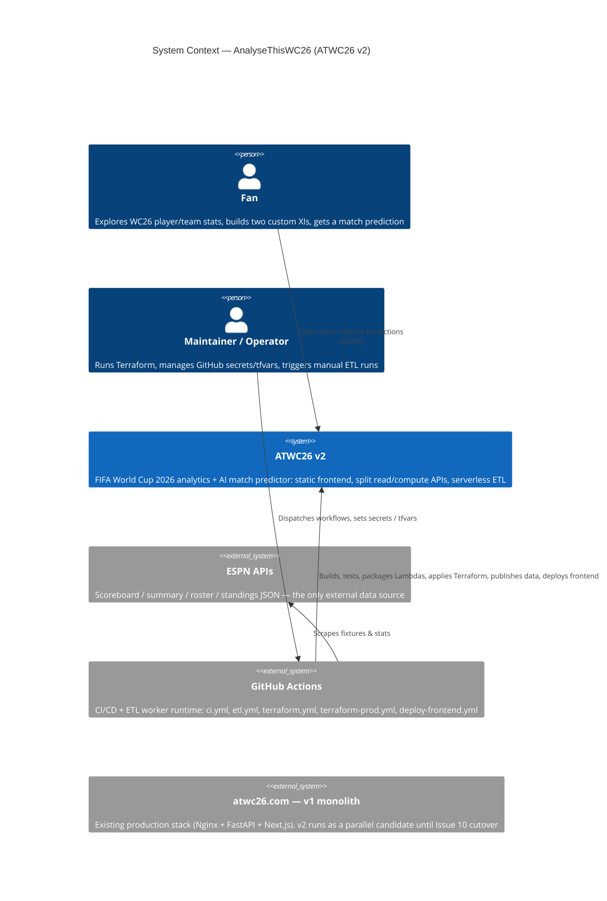
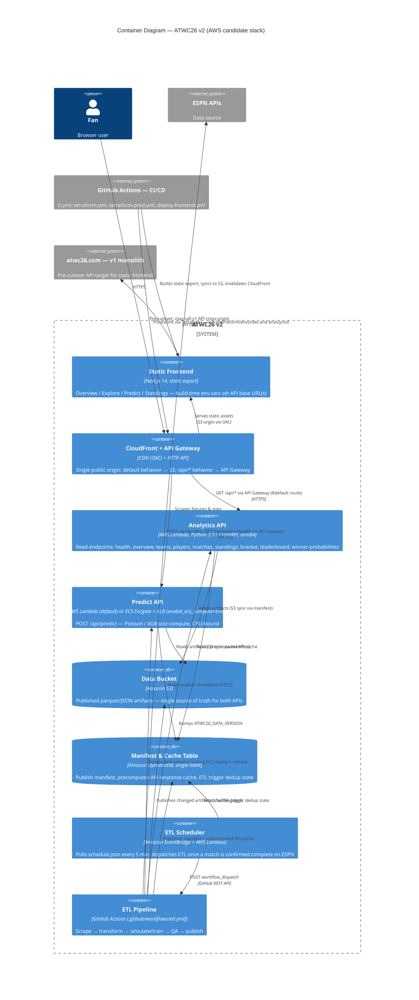
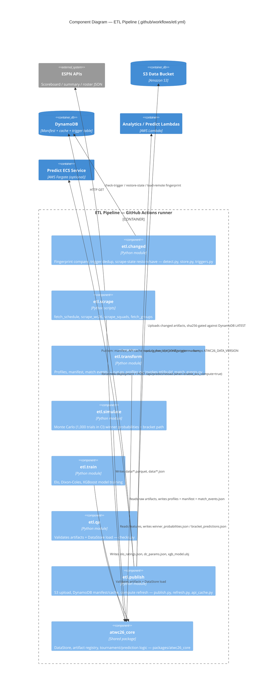
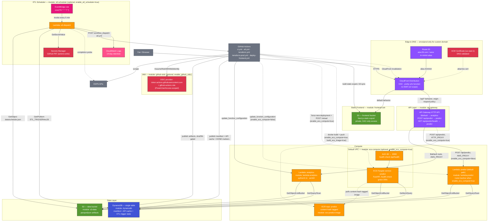

# AnalyseThisWC26 v2 — Architecture (C4 model + AWS deployment)

System-wide architecture for the ATWC26 v2 candidate stack: C4 context/container/component views plus a full AWS deployment map. For operational detail, follow the links below rather than duplicating runbooks here.

| Doc | Read when… |
|-----|------------|
| **[etl/OVERVIEW.md](etl/OVERVIEW.md)** | ETL cross-boundary contract, scheduler ↔ pipeline handoff |
| **[etl/SCHEDULER.md](etl/SCHEDULER.md)** | EventBridge/Lambda dispatch, trigger windows, DynamoDB dedup |
| **[etl/PIPELINE.md](etl/PIPELINE.md)** | `etl.yml` steps, scrape → publish, fingerprints |
| **[ops/DEPLOY.md](ops/DEPLOY.md)** | How to build and deploy (Docker, AWS, frontend) |
| **[ops/CUTOVER.md](ops/CUTOVER.md)** | v1 → v2 production cutover checklist |
| **[specs/PRODUCTION_SPEC.md](specs/PRODUCTION_SPEC.md)** | Production toggles, secrets, enablement order |
| **[`infra/README.md`](../infra/README.md)** | Terraform modules, outputs, GitHub Actions wiring |

**Sources:** `infra/terraform/**`, `.github/workflows/` (`ci.yml`, `etl.yml`, `terraform.yml`, `terraform-prod.yml`, `deploy-frontend.yml`), `services/`, `etl/`, `packages/atwc26_core/`.

> **Diagram colors.** §4 extends the AWS-service palette used in [etl/SCHEDULER.md](etl/SCHEDULER.md) (compute, storage, database, security, integration, logs) with additional **edge** (purple) classes for Route 53, CloudFront, and API Gateway.

---

## Table of Contents

1. [C4 Model — Level 1: System Context](#1-c4-model--level-1-system-context)
2. [C4 Model — Level 2: Container Diagram](#2-c4-model--level-2-container-diagram)
3. [C4 Model — Level 3: Component Diagram (ETL Pipeline)](#3-c4-model--level-3-component-diagram-etl-pipeline)
4. [AWS Deployment Architecture](#4-aws-deployment-architecture)
5. [Source map](#source-map)

---

## 1. C4 Model — Level 1: System Context

**Reading this:** the fan only ever talks to the v2 system over HTTPS. Everything else — scraping ESPN, building/testing/deploying, applying infrastructure — is GitHub Actions acting as the system's CI/CD and ETL runtime.

The v1 monolith (`atwc26.com`) is a separate existing system that v2 is meant to eventually replace ([ops/CUTOVER.md](ops/CUTOVER.md)). **Pre-cutover**, the static frontend may call the v1 API **cross-origin** via `NEXT_PUBLIC_API_URL` / `backend_api_url` baked at build time — CloudFront does **not** proxy `/api/*` to v1; it routes `/api/*` to v2 API Gateway. After cutover, the frontend uses same-origin `/api` via CloudFront ([ops/DEPLOY.md](ops/DEPLOY.md), [`infra/README.md`](../infra/README.md)).

---

## 2. C4 Model — Level 2: Container Diagram

**Reading this:** the API is deliberately split by workload shape — `analytics` is read-heavy and stateless (Lambda is a natural fit), `predict` is CPU-bound and can outgrow a Lambda's timeout/memory envelope, so the stack lets you flip it onto Fargate behind an ALB without changing the route contract. Both compute containers share one S3 bucket and one DynamoDB table as their only shared state. API cache rows are **written by ETL publish**; analytics **reads** them at request time (with in-memory fallback compute). Predict reads the **publish manifest** to know which S3 artifacts to sync — it does not use the API response cache.

---

## 3. C4 Model — Level 3: Component Diagram (ETL Pipeline)

This level maps `.github/workflows/etl.yml` and the `etl/` package. For step-by-step workflow detail, see [etl/PIPELINE.md](etl/PIPELINE.md). For the AWS scheduler that dispatches the workflow, see [etl/SCHEDULER.md](etl/SCHEDULER.md).

**Reading this:** `etl.changed` is the gatekeeper on both ends — it can skip an entire GHA run if the scheduler already marked a game `#DONE`, and it can skip transform/publish if ESPN's data hasn't actually changed since the fingerprint was last saved. Everything downstream of `publish` is idempotent (S3 uploads and Lambda/ECS refreshes only fire when a SHA-256 actually differs).

---

## 4. AWS Deployment Architecture

Full-stack AWS map. The ETL scheduler slice is expanded operationally in [etl/SCHEDULER.md](etl/SCHEDULER.md); Terraform module wiring is in [`infra/README.md`](../infra/README.md).

**Legend**

| Color | AWS category | Services in this diagram |
|---|---|---|
| Purple `#8C4FFF` | Networking & content delivery | Route 53, CloudFront, API Gateway |
| Orange `#FF9900` | Compute | Lambda ×3, ALB, ECS Fargate, ECR |
| Green `#569A31` | Storage | S3 (frontend bucket, data bucket) |
| Blue `#4053D6` | Database | DynamoDB |
| Red `#DD344C` | Security, identity & compliance | ACM, Secrets Manager, IAM/OIDC |
| Pink `#E7157B` | Application integration | EventBridge |
| Magenta `#FF4F8B` | Management & governance | CloudWatch Logs |
| Gray `#6B7280` | External | Browser, ESPN, GitHub Actions |

**Key deployment facts** (confirmed in `infra/terraform/**`):

- The predict route is a **runtime toggle, not two parallel paths**: `enable_ecs_compute` (default `false`) decides whether `POST /api/predict` hits `lambda-predict` or the ECS/ALB path — API Gateway swaps the integration with `create_before_destroy` so the route survives the switch.
- **Feature toggles differ by environment** (`infra/terraform/envs/dev/variables.tf` vs `envs/prod/variables.tf`):

  | Toggle | `envs/dev` default | `envs/prod` default |
  |--------|-------------------|---------------------|
  | `enable_github_oidc` | `false` | `true` |
  | `enable_etl_scheduler` | `false` | `false` |
  | `enable_ecs_compute` | `false` | `false` |

  A fresh **dev** `terraform apply` provisions the data/API/CDN stack but not the OIDC role or AWS-side ETL scheduler until explicitly turned on. See [specs/PRODUCTION_SPEC.md](specs/PRODUCTION_SPEC.md) Part 1 for enablement order.

- **GitHub OIDC trust** defaults also differ: dev tfvars default to `github_org = "neunov"` / `github_repo = "AnalyseThisWC26"`; prod defaults to `madmmas` / `atwc26_v2`. Override in `terraform.tfvars` for your fork.
- `envs/prod` adds **ACM (us-east-1) + Route 53 alias records** for `atwc26.com`/`www` on top of the same module set `envs/dev` uses — `envs/dev` has no custom domain by default.
- CloudFront intentionally ships **without WAF** in this phase (CDN + TLS only) — called out in [`infra/README.md`](../infra/README.md).
- **ECS image builds** (only when `enable_ecs_compute=true` and `build_ecs_image=true`): `ecs-predict-image` hashes `services/predict_api/`, `services/shared/`, and `packages/atwc26_core/atwc26_core/`, then `terraform apply` runs `docker build && push` via `local-exec`. The default predict path is Lambda and needs no ECR image. `deploy-predict-ecs` in `terraform.yml` exists for image-only redeploys without a full apply.

---

## Source map

| Diagram element | Source file(s) |
|---|---|
| Frontend / CDN | `infra/terraform/modules/frontend-cdn/main.tf`, [`infra/README.md`](../infra/README.md) |
| API Gateway routing | `infra/terraform/modules/api-gateway/main.tf` |
| Analytics / Predict Lambdas | `infra/terraform/modules/lambda-analytics/main.tf`, `infra/terraform/modules/lambda-predict/main.tf` |
| ECS Fargate + ALB | `infra/terraform/modules/ecs-compute/main.tf` |
| ECR content-hash build | `infra/terraform/modules/ecs-predict-image/main.tf` |
| S3 data + DynamoDB | `infra/terraform/modules/s3-data/main.tf`, `infra/terraform/modules/dynamodb/main.tf` |
| ETL scheduler (EventBridge/Lambda/Secrets) | `infra/terraform/modules/etl-scheduler/main.tf`, [etl/SCHEDULER.md](etl/SCHEDULER.md) |
| ACM + Route 53 (prod) | `infra/terraform/modules/acm-certificate/main.tf`, `infra/terraform/envs/prod/dns.tf` |
| GitHub OIDC role | `infra/terraform/modules/github-oidc/main.tf` |
| ETL GitHub Action | `.github/workflows/etl.yml`, [`etl/README.md`](../etl/README.md), [etl/PIPELINE.md](etl/PIPELINE.md) |
| CI / Terraform / deploy workflows | `.github/workflows/ci.yml`, `terraform.yml`, `terraform-prod.yml`, `deploy-frontend.yml` |
| Env toggles & defaults | `infra/terraform/envs/dev/variables.tf`, `infra/terraform/envs/prod/variables.tf` |
| System purpose / v1 vs v2 | root `README.md`, [ops/DEPLOY.md](ops/DEPLOY.md), [specs/PRODUCTION_SPEC.md](specs/PRODUCTION_SPEC.md) |
