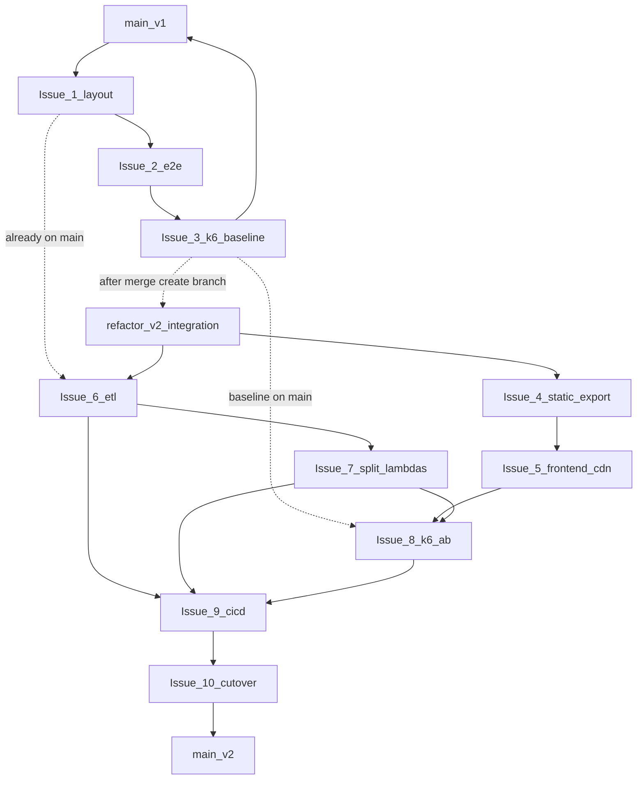

# v2 refactor — branch handoff (index)

Production ([atwc26.com](https://atwc26.com)) runs the **v1 monolith** on `main` until Issue 10 cutover.

## Two tracks

| Track | Issues | Target branch | When |
|-------|--------|---------------|------|
| **v1 prep** | 1–3 | `main` | Now — improve v1 before refactor |
| **v2 refactor** | 4–10 | `refactor/v2-integration` | After Issue 3 merges to `main` |

```text
main ──► Issue 1 ──► Issue 2 ──► Issue 3 ──► (tag v1-baseline optional)
                                              │
                                              ▼
                              refactor/v2-integration
                              Issue 4 → … → Issue 10 → merge to main
```

## Documents

| Doc | Purpose |
|-----|---------|
| **[REFACTOR_GITHUB_ISSUES.md](REFACTOR_GITHUB_ISSUES.md)** | Copy-paste all 10 issue titles and bodies |
| **[CUTOVER.md](CUTOVER.md)** | Production cutover checklist *(v2)* |

---

## Branch strategy

### Track A — v1 prep (Issues 1–3)

| Setting | Value |
|---------|--------|
| Base | `main` |
| Feature branches | `feat/reorganize-layout`, `feat/e2e-tests-v1`, `feat/k6-baseline` |
| Merge into | **`main`** directly |
| Label | `refactor-v1` |

**PR rules:**

1. One issue = one PR to `main`.
2. Merge in order: 1 → 2 → 3.
3. Do not start `refactor/v2-integration` until Issue 3 is on `main`.

**Suggested checkpoint after Issue 3:**

```bash
git checkout main && git pull
git tag v1-baseline   # optional
git checkout -b refactor/v2-integration
git push -u origin refactor/v2-integration
```

### Track B — v2 refactor (Issues 4–10)

| Setting | Value |
|---------|--------|
| Base | `refactor/v2-integration` (from `main` after Issue 3) |
| Feature branches | `feat/*` per issue below |
| Merge into | **`refactor/v2-integration`** |
| Final merge | Issue 10: `refactor/v2-integration` → **`main`** |
| Label | `refactor-v2` |

**PR rules:**

1. Do **not** PR v2 feature branches directly to `main` (except final cutover).
2. One issue = one PR; `Closes #N` in body.
3. Merge order: 4 → 10.
4. Candidate AWS: separate `name_prefix` (e.g. `atwc26-v2`).
5. Tag `main` before final merge: `v1-monolith`.

### Labels

- `refactor-v1` — Issues 1–3
- `refactor-v2` — Issues 4–10
- `blocked` — waiting on upstream
- `ops` — Issue 10 cutover

---

## Dependency graph



---

## Issue → branch → target (summary)

| # | Track | Branch | Merges to | Commit subject |
|---|-------|--------|-----------|----------------|
| 1 | v1 | `feat/reorganize-layout` | `main` | `refactor: move docs, notebooks, and scrapers` |
| 2 | v1 | `feat/e2e-tests-v1` | `main` | `test: add end-to-end tests for v1 API` |
| 3 | v1 | `feat/k6-baseline` | `main` | `perf: k6 baseline against v1 production` |
| 4 | v2 | `feat/frontend-static-export` | `refactor/v2-integration` | `feat(v2): static export frontend for S3` |
| 5 | v2 | `feat/frontend-cdn-infra` | `refactor/v2-integration` | `infra(v2): S3 and CloudFront for static frontend` |
| 6 | v2 | `feat/etl-pipeline-aws` | `refactor/v2-integration` | `feat(v2): ETL pipeline with S3, DynamoDB, and QA` |
| 7 | v2 | `feat/split-lambda-apis` | `refactor/v2-integration` | `feat(v2): split APIs into analytics and predict Lambdas` |
| 8 | v2 | `feat/k6-ab-compare` | `refactor/v2-integration` | `perf(v2): k6 A/B compare v1 and v2` |
| 9 | v2 | `feat/full-cicd` | `refactor/v2-integration` | `ci(v2): complete CI/CD pipeline` |
| 10 | v2 | `chore/remove-v1-monolith` | `refactor/v2-integration` then `main` | `chore(v2): cut over to v2 and remove v1 monolith` |

Full issue bodies: [REFACTOR_GITHUB_ISSUES.md](REFACTOR_GITHUB_ISSUES.md)

---

## Contributor message template

```text
Refactor is split across two tracks:

v1 on main (do first):
  #1 reorganize docs / notebooks / etl/scrape
  #2 e2e tests for v1 API
  #3 k6 baseline vs atwc26.com

Then create refactor/v2-integration from main:

v2 on integration branch:
  #4–5 static frontend + S3/CloudFront (still v1 API)
  #6 ETL + S3 + DynamoDB + shared package
  #7 split Lambdas (analytics + predict)
  #8 k6 A/B v1 vs v2
  #9 full CI/CD
  #10 cutover → main

Docs: docs/REFACTOR_GITHUB_ISSUES.md
```

---

## Suggested first actions

1. Create labels `refactor-v1` and `refactor-v2`.
2. Open PR **Issue 1** → `main`.
3. After Issues 1–3 merge, tag `v1-baseline` (optional) and push `refactor/v2-integration`.
4. Open PRs **Issues 4–9** → `refactor/v2-integration` in order.
5. Issue 10: integration → `main` after k6 A/B and cutover checklist.
