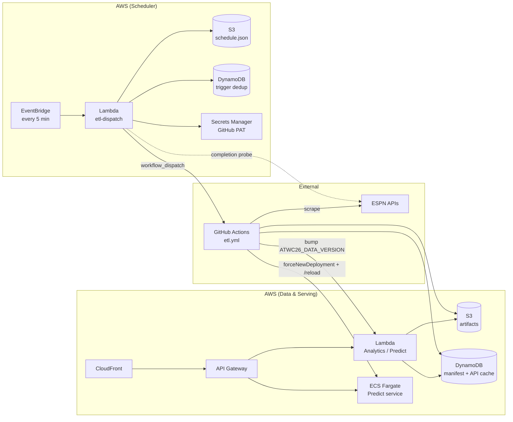
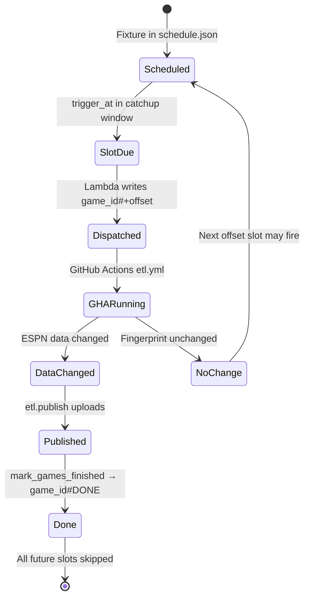
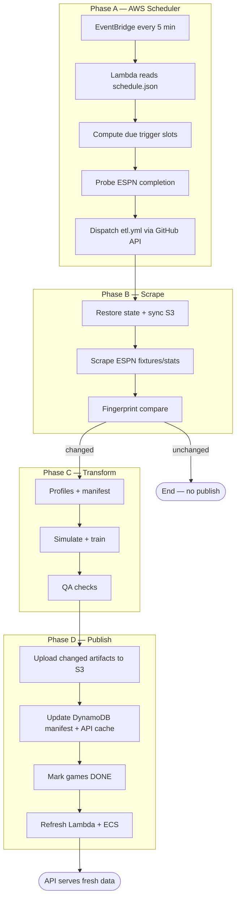

# ETL System Overview

High-level map of the ATWC26 data pipeline: an **AWS scheduler** dispatches **GitHub Actions** to scrape ESPN, transform data, and publish to S3/DynamoDB so the live API serves fresh artifacts.

| Doc | Read when… |
|-----|------------|
| **[ARCHITECTURE.md](../ARCHITECTURE.md)** | Full system C4 model + AWS estate (frontend, APIs, scheduler, data layer) |
| **[SCHEDULER.md](SCHEDULER.md)** | Debugging missed or duplicate GHA dispatches, trigger windows, EventBridge/Lambda |
| **[PIPELINE.md](PIPELINE.md)** | Debugging scrape/transform/publish, fingerprints, artifacts, compute refresh |
| [`etl/README.md`](../../etl/README.md) | Makefile targets, env vars, artifact tables (operator runbook) |

**Also see:** [`PRODUCTION_SPEC.md`](../specs/PRODUCTION_SPEC.md) (cutover), [`infra/README.md`](../../infra/README.md) (Terraform).

---

## Two cooperating halves

| Half | Where it runs | Responsibility |
|------|---------------|----------------|
| **Scheduler** | AWS (EventBridge + Lambda) | Poll every 5 minutes; decide which matches need ETL; dispatch GitHub Actions |
| **ETL worker** | GitHub Actions (`etl.yml`) | Scrape ESPN → transform → simulate/train → QA → publish to S3/DynamoDB → warm compute |

Scheduling is **not** done by a GitHub cron. The `etl.yml` workflow only accepts `workflow_dispatch` (manual or Lambda-dispatched).



---

## Cross-boundary contract

These are the shared interfaces between the scheduler and the pipeline. Both docs reference this section.

### `data/schedule.json`

Published to S3 at `data/schedule.json`. The Lambda dispatcher reads it every 5 minutes; the scrape phase refreshes it via `fetch_schedule.py`.

Per-game structure:

```json
{
  "760414": {
    "kickoff_utc": "2026-06-12T02:00Z",
    "home": "South Korea",
    "away": "Czechia",
    "round_slug": "group-stage",
    "completed": true,
    "status_state": "post",
    "status_name": "STATUS_FULL_TIME"
  }
}
```

`round_slug` controls trigger windows: `group-stage` uses a shorter poll window than knockout rounds. See [SCHEDULER.md § Trigger timing](SCHEDULER.md#trigger-timing-windows).

### DynamoDB trigger keys

Partition key `ETL_TRIGGER#wc26` (same table as the publish manifest):

| SK | Written by | Purpose |
|----|------------|---------|
| `{game_id}#+{offset}` | Lambda dispatcher | Prevents re-dispatching the same time slot |
| `{game_id}#DONE` | `etl.publish` (`mark_games_finished`) | Stops all future scheduler slots for that game |

### Handoff: dispatch → DONE



1. **Lambda** POSTs `workflow_dispatch` on `etl.yml` with `inputs.trigger_game_id={game_id}`.
2. **GHA** runs `python -m etl.changed check-trigger $game_id` — skips the run if `{game_id}#DONE` already exists.
3. **Publish** compares pre/post fingerprints; for games whose `data/raw/{id}.json` changed, writes `{game_id}#DONE`.

---

## End-to-end phases



| Phase | Detail doc |
|-------|------------|
| **A** — Scheduler | [SCHEDULER.md](SCHEDULER.md) |
| **B–D** — Pipeline | [PIPELINE.md](PIPELINE.md) |

### In plain language

1. **EventBridge** ticks every 5 minutes and invokes the **ETL dispatch Lambda**.
2. The Lambda loads **schedule.json**, finds due post-match windows, confirms the match is **completed on ESPN**, and dispatches **GitHub Actions**.
3. GHA **scrapes ESPN**, compares fingerprints, and skips work if nothing changed.
4. On change, it **transforms**, **simulates**, optionally **trains**, runs **QA**, then **publishes** to S3 and DynamoDB.
5. Publish marks finished games **DONE**, precomputes **API cache** rows, and **refreshes** Lambda/ECS so the live site serves new data.

---

## When to read which doc

| Symptom | Start here |
|---------|------------|
| GHA never fired after a match ended | [SCHEDULER.md](SCHEDULER.md) — trigger windows, ESPN completion gate, `#+offset` dedup |
| GHA fired but exited immediately | [OVERVIEW.md § Handoff](OVERVIEW.md#handoff-dispatch--done) — `{game_id}#DONE` already set |
| GHA ran but skipped transform/publish | [PIPELINE.md § Change detection](PIPELINE.md#change-detection) — fingerprint unchanged |
| Data published but API stale | [PIPELINE.md § Compute refresh](PIPELINE.md#publish--compute-refresh) — Lambda env bump, ECS reload |
| Manual full refresh | [PIPELINE.md § Manual operations](PIPELINE.md#manual--local-operations) |
