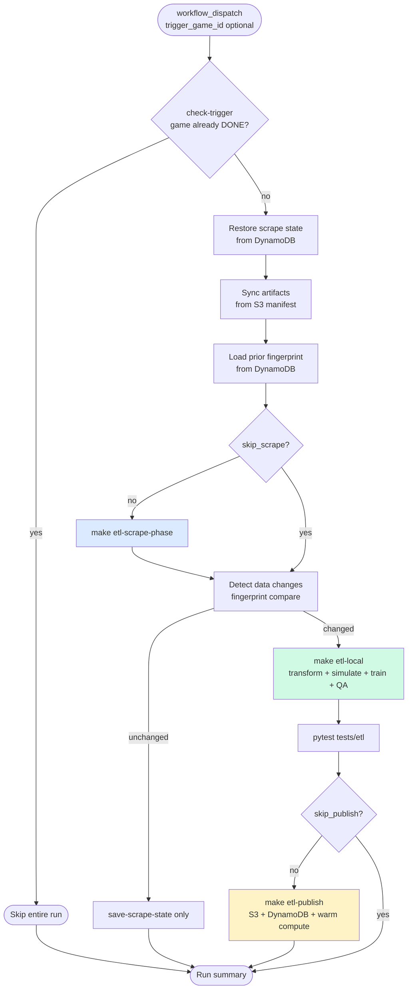
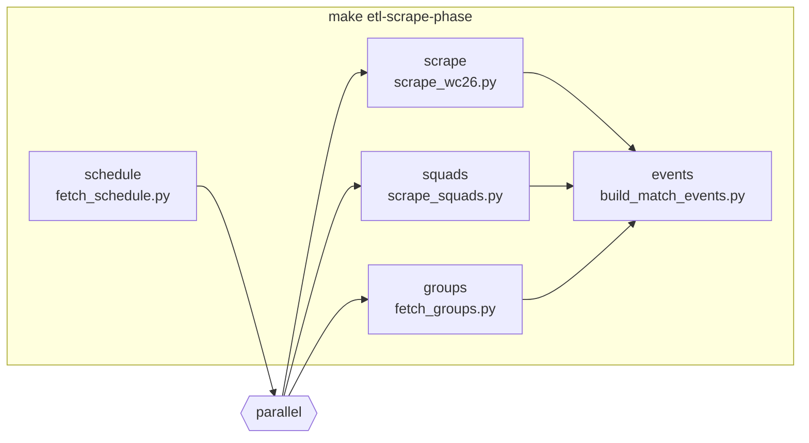
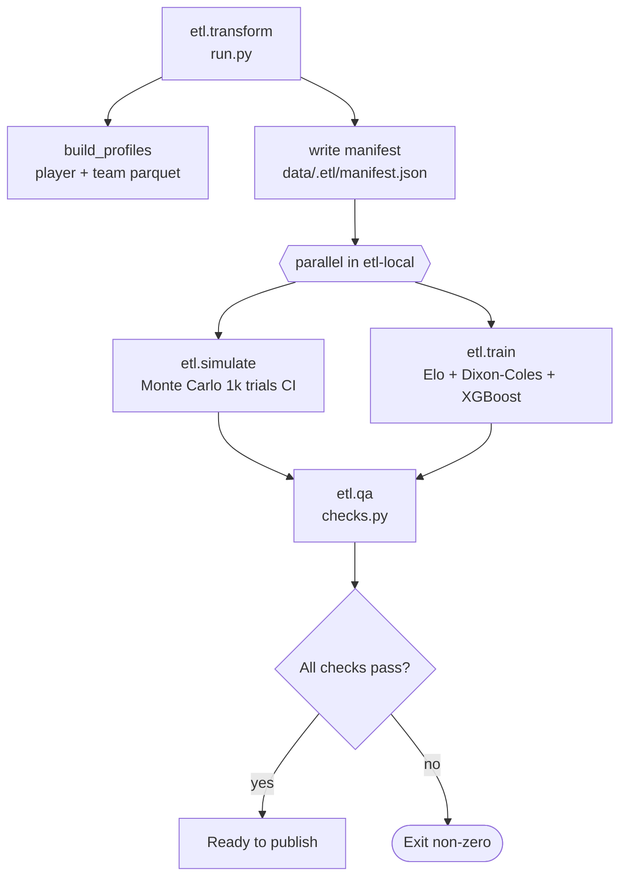
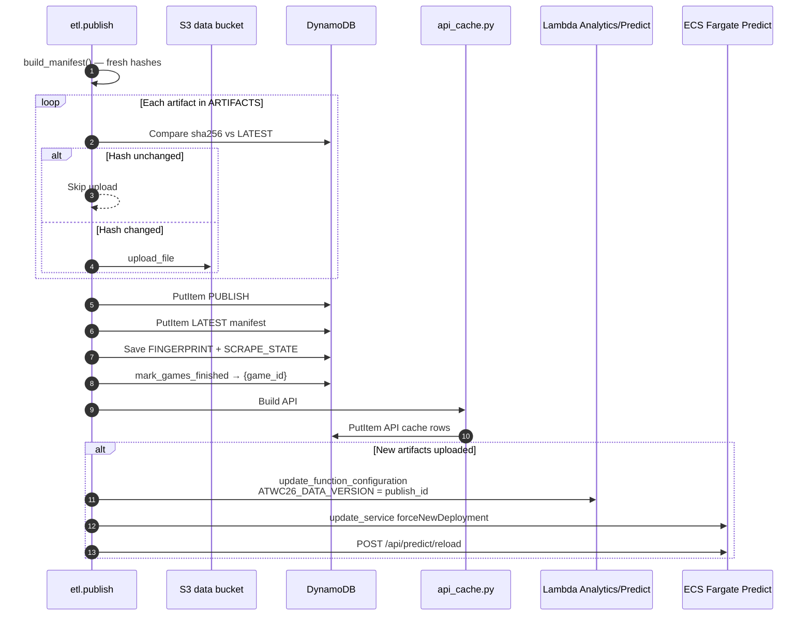

# ETL Pipeline

GitHub Actions workflow that scrapes ESPN, transforms data, runs models, validates output, and publishes artifacts to S3/DynamoDB. Triggered by the [AWS scheduler](SCHEDULER.md) (`workflow_dispatch`) or manually.

**Related:** [ARCHITECTURE.md](../ARCHITECTURE.md) (§3 ETL component diagram), [OVERVIEW.md](OVERVIEW.md) (end-to-end map), [`etl/README.md`](../../etl/README.md) (Makefile & artifacts runbook), [`.github/workflows/etl.yml`](../../.github/workflows/etl.yml).

---

## Table of Contents

1. [GitHub Actions Workflow](#github-actions-workflow)
2. [Scrape Phase](#scrape-phase)
3. [Change Detection](#change-detection)
4. [Transform, Simulate & Train](#transform-simulate--train)
5. [Publish & Compute Refresh](#publish--compute-refresh)
6. [DynamoDB Publish State](#dynamodb-publish-state)
7. [Data Sources & Artifacts](#data-sources--artifacts)
8. [Manual & Local Operations](#manual--local-operations)

---

## GitHub Actions Workflow

When Lambda (or a human) dispatches `etl.yml`, a single job runs with conditional steps based on change detection.



### Step-by-step

| Step | Workflow step | What happens |
|------|---------------|--------------|
| **B0** | `Configure AWS credentials` | Runner assumes IAM role via GitHub OIDC (`ATWC26_AWS_ROLE_ARN`). |
| **B1** | `Check scheduler trigger still needed` | `python -m etl.changed check-trigger $game_id` — exits early if DynamoDB has `{game_id}#DONE`. Manual runs (empty `trigger_game_id`) always proceed. |
| **B2** | `Restore scrape state` | `python -m etl.changed restore-state` — downloads `processed_games.json` from DynamoDB. |
| **B3** | `Sync published artifacts` | `sync_from_manifest()` pulls changed remote artifacts from S3. |
| **B4** | `Load prior fingerprint` | `python -m etl.changed load-remote` — saves pre-scrape SHA-256 hashes to `/tmp/etl-fp.json`. |
| **B5** | `Scrape ESPN data` | `make etl-scrape-phase` — see [Scrape Phase](#scrape-phase). |
| **B6** | `Detect data changes` | `etl.changed compare` — skip transform/publish if unchanged. `compare-matches` decides training. |
| **B7** | `Persist scrape state` | When data unchanged, still saves `processed_games.json` to DynamoDB. |
| **B8** | `Transform + simulate + QA` | `make etl-local` with `ATWC26_SIMULATE_TRIALS=1000`. Sets `ATWC26_SKIP_TRAIN=1` when only bracket/standings changed. |
| **B9** | `ETL tests` | `pytest tests/etl etl/qa`. |
| **B10** | `Publish` | `make etl-publish` — see [Publish & Compute Refresh](#publish--compute-refresh). |

**Concurrency:** `concurrency: group: etl-${{ github.ref }}, cancel-in-progress: true` — one ETL run per branch; newer dispatch cancels in-flight.

**Workflow inputs:**

| Input | Default | Purpose |
|-------|---------|---------|
| `skip_scrape` | `false` | Use committed `data/` artifacts only |
| `skip_publish` | `false` | Transform without uploading |
| `trigger_game_id` | `""` | Scheduler game ID (empty for manual runs) |

---

## Scrape Phase

`make etl-scrape-phase` runs:



### Scrape scripts

| Step | Script | ESPN source | Output |
|------|--------|-------------|--------|
| **S1** | `etl/scrape/fetch_schedule.py` | Scoreboard API | `data/schedule.json`, `etl/scrape/game_links.csv` |
| **S2** | `etl/scrape/scrape_wc26.py` | Per-game summary + roster stats | `data/raw/{gameId}.json`, `data/all_players_stats.parquet`, `data/processed_games.json` |
| **S3** | `etl/scrape/scrape_squads.py` | Team roster API | `data/squads_raw.json` |
| **S4** | `etl/scrape/fetch_groups.py` | Standings + knockout scoreboard | `data/standings.json`, `data/bracket.json` |
| **S5** | `etl/build_match_events.py` | Reads `data/raw/*.json` | `data/match_events.json` |

`scrape_wc26.py` is **incremental**: only fetches games in `game_links.csv` not yet in `processed_games.json`.

---

## Change Detection

`etl/changed/detect.py` fingerprints every file under `data/` (except `processed_games.json`).

| Check | Module | Effect |
|-------|--------|--------|
| `compare` | `detect.py` | If post-scrape fingerprint equals pre-scrape → skip transform and publish |
| `compare-matches` | `detect.py` | If only `standings.json` / `bracket.json` changed → set `ATWC26_SKIP_TRAIN=1` |
| `check-trigger` | `triggers.py` | If `{game_id}#DONE` in DynamoDB → skip entire GHA run |
| `changed_game_ids` | `detect.py` | Game IDs with new/changed `data/raw/{id}.json` → `mark_games_finished` on publish |

---

## Transform, Simulate & Train

`make etl-local` orchestrates post-scrape processing:



| Step | Module | What happens |
|------|--------|--------------|
| **C1** | `etl/transform/run.py` | Match events skipped in `etl-local` (`ATWC26_SKIP_MATCH_EVENTS=1`). |
| **C2** | `etl/transform/profiles.py` | `player_profiles.parquet`, `team_profiles.parquet`. |
| **C3** | `build_manifest()` | SHA-256 hashes → `data/.etl/manifest.json`. |
| **C4** | `etl/simulate/run.py` | 1,000 trials in CI → `winner_probabilities.json`, `bracket_predictions.json`. |
| **C5** | `etl/train/run.py` | Elo, Dixon-Coles, XGBoost. Skipped when `ATWC26_SKIP_TRAIN=1`. |
| **C6** | `etl/qa/checks.py` | Validates artifacts and `DataStore` load. |

---

## Publish & Compute Refresh

`make etl-publish` (`python -m etl.publish`) uploads artifacts and notifies serving infrastructure.



### Publish steps

| Step | Function | What happens |
|------|----------|--------------|
| **D1** | `publish_aws()` | Upload to S3 if SHA-256 differs from DynamoDB `LATEST`. |
| **D2** | DynamoDB manifest | `DATASET#wc26` / `PUBLISH#{timestamp}` + `LATEST` update. |
| **D3** | `_persist_etl_state()` | Saves fingerprint and `processed_games.json` for next run. |
| **D4** | `mark_games_finished()` | Writes `ETL_TRIGGER#wc26` / `{id}#DONE` for changed games. |
| **D5** | `_publish_api_caches()` | Precomputes `API#standings`, `API#teams`, `API#match#{id}`, etc. |
| **D6** | `refresh_compute()` | Bumps `ATWC26_DATA_VERSION` on Lambdas; ECS rolling deploy + `/api/predict/reload`. |

Publish is **idempotent**: artifacts whose `sha256` matches `LATEST` are skipped.

### Downstream read path (analytics)

When a user hits the API, the analytics Lambda resolves data in order:

1. In-memory cache (warm container)
2. DynamoDB `API#*` precomputed item
3. S3 / local artifact fallback via `DataStore`

---

## DynamoDB Publish State

Partition key `DATASET#wc26` (same table as trigger keys):

```mermaid
erDiagram
    DATASET_WC26 ||--o{ PUBLISH_HISTORY : has
    DATASET_WC26 ||--|| LATEST : points_to
    DATASET_WC26 ||--|| FINGERPRINT : stores
    DATASET_WC26 ||--|| SCRAPE_STATE : stores
    DATASET_WC26 ||--o{ API_CACHE : precomputes

    DATASET_WC26 {
        string PK "DATASET#wc26"
        string SK "varies"
    }
    LATEST {
        string SK "LATEST"
        map artifacts "name -> s3_key, sha256, bytes"
        string published_at
    }
    FINGERPRINT {
        string SK "FINGERPRINT"
        map hashes "path -> sha256"
    }
    SCRAPE_STATE {
        string SK "SCRAPE_STATE"
        json processed_games
    }
    API_CACHE {
        string SK "API#standings | API#match#id | ..."
        json payload
    }
```

| SK | Purpose |
|----|---------|
| `LATEST` | Current artifact manifest (sha256 per file) |
| `PUBLISH#{timestamp}` | Publish history row |
| `FINGERPRINT` | Scrape input hashes for change detection |
| `SCRAPE_STATE` | `processed_games.json` for incremental scrape |
| `API#standings`, `API#teams`, `API#match#{id}`, … | Precomputed API responses |

Trigger keys (`ETL_TRIGGER#wc26`) are documented in [SCHEDULER.md](SCHEDULER.md#dynamodb-trigger-state).

---

## Data Sources & Artifacts

### ESPN APIs

| Endpoint pattern | Used by |
|------------------|---------|
| `site.api.espn.com/.../scoreboard?dates=` | `fetch_schedule.py` |
| `site.web.api.espn.com/.../summary?event={id}` | `scrape_wc26.py` |
| Team roster / standings APIs | `scrape_squads.py`, `fetch_groups.py` |

Default league slug: `fifa.world`.

### Published artifacts

| File | Required | Produced by |
|------|----------|-------------|
| `all_players_stats.parquet` | yes | scrape |
| `match_events.json` | yes | build_match_events |
| `player_profiles.parquet` | no | transform |
| `team_profiles.parquet` | no | transform |
| `winner_probabilities.json` | no | simulate |
| `bracket_predictions.json` | no | simulate |
| `elo_ratings.json`, `dc_params.json`, `xgb_model.ubj`, `xgb_features.json` | no | train |
| `backtest_summary.json` | no | train (hold-out metrics for Track Record) |
| `standings.json`, `bracket.json` | no | fetch_groups |
| `squads_raw.json` | no | scrape_squads |
| `schedule.json` | no | fetch_schedule |

S3 keys use prefix `data/` (`ATWC26_S3_PREFIX`). Full artifact registry: `packages/atwc26_core/atwc26_core/artifacts.py`.

---

## Manual & Local Operations

### Trigger from GitHub UI

Actions → ETL → Run workflow:

- `skip_scrape` — use committed `data/` only
- `skip_publish` — transform without uploading
- `trigger_game_id` — leave empty for a full manual run

### Trigger from CLI

```bash
make setup-etl
make etl-refresh      # scrape + transform + simulate + QA
make etl-publish      # requires ATWC26_S3_BUCKET + AWS creds
```

### Key environment variables

| Variable | Used by | Purpose |
|----------|---------|---------|
| `ATWC26_S3_BUCKET` | publish, GHA | Target artifact bucket |
| `ATWC26_DYNAMODB_TABLE` | publish, changed | Manifest + trigger state |
| `ATWC26_SIMULATE_TRIALS` | simulate | Trial count (1000 in CI) |
| `ATWC26_SKIP_TRAIN` | train | Skip model retraining |
| `ATWC26_LAMBDA_ANALYTICS_NAME` | refresh | Lambda env bump target |
| `ATWC26_ECS_CLUSTER` / `ATWC26_ECS_SERVICES` | refresh | ECS rolling deploy |
| `ATWC26_PREDICT_SERVICE_URL` | refresh | POST `/api/predict/reload` |
| `ETL_BEFORE_FINGERPRINT` | publish | Path to pre-scrape fingerprint file |

### Source files

```
.github/workflows/etl.yml
etl/scrape/                     ESPN scrapers
etl/transform/                  Profiles + manifest
etl/simulate/                   Monte Carlo
etl/train/                      Model training
etl/qa/                         Validation
etl/publish/                    S3/DynamoDB publish + refresh
etl/changed/                    Fingerprints + trigger DONE markers
services/shared/data_sync.py    S3 sync from manifest
packages/atwc26_core/           DataStore, artifacts, config
```
