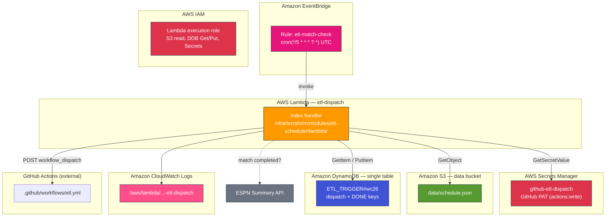
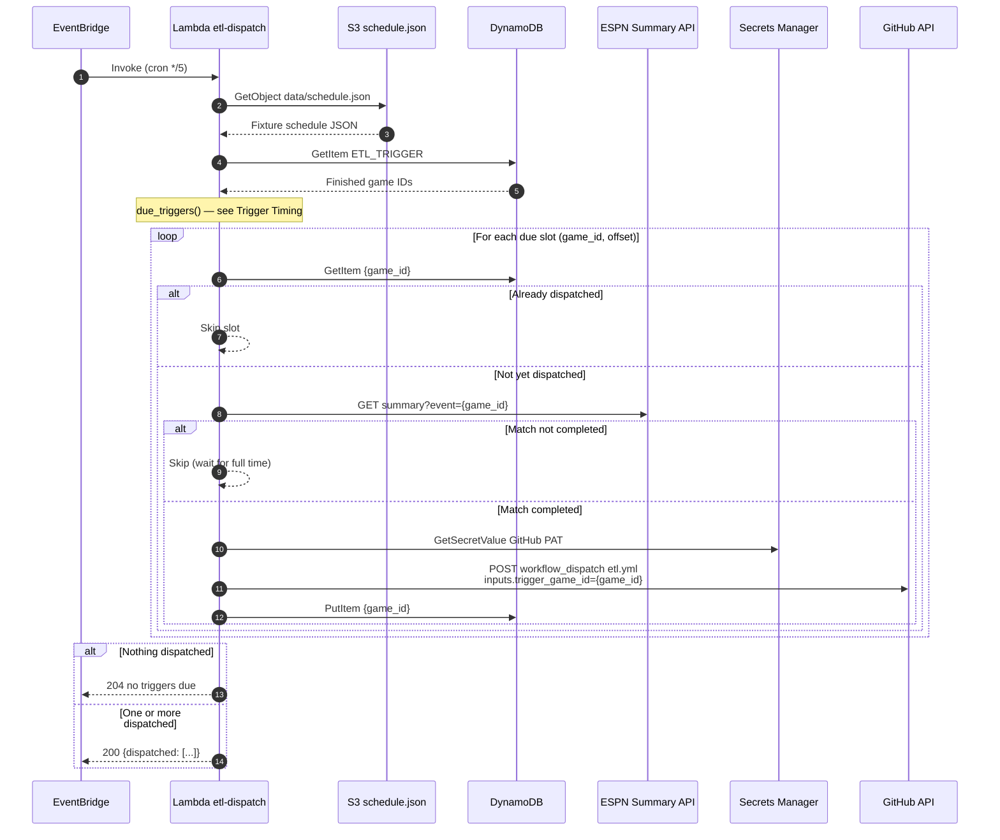

# ETL Event Scheduler

Match-timed ETL dispatch runs in AWS: **EventBridge** polls every 5 minutes, a **Lambda** function reads `schedule.json`, decides which post-match trigger slots are due, and dispatches **GitHub Actions** via the API.

**Related:** [OVERVIEW.md](OVERVIEW.md) (cross-boundary contract), [PIPELINE.md](PIPELINE.md) (what GHA does after dispatch), [`infra/terraform/modules/etl-scheduler/`](../../infra/terraform/modules/etl-scheduler/).

---

## Table of Contents

1. [AWS Architecture](#aws-architecture)
2. [Terraform Resources](#terraform-resources)
3. [Lambda Handler Flow](#lambda-handler-flow)
4. [Trigger Timing Windows](#trigger-timing-windows)
5. [ESPN Completion Gate](#espn-completion-gate)
6. [DynamoDB Trigger State](#dynamodb-trigger-state)
7. [Configuration](#configuration)
8. [Source Files & Tests](#source-files--tests)

---

## AWS Architecture



**Not used:** SQS, SNS, Step Functions, CDK, GitHub-native cron on `etl.yml`.

---

## Terraform Resources

Module: `infra/terraform/modules/etl-scheduler/`, enabled via `enable_etl_scheduler = true` in `infra/terraform/envs/{dev,prod}/main.tf`.

| Resource | Name pattern | Purpose |
|----------|--------------|---------|
| `aws_cloudwatch_event_rule` | `{prefix}-{env}-etl-match-check` | 5-minute cron |
| `aws_lambda_function` | `{prefix}-{env}-etl-dispatch` | Schedule checker + GitHub dispatcher |
| `aws_secretsmanager_secret` | `{prefix}-{env}-github-etl-dispatch` | GitHub PAT (`actions:write`) |
| `aws_iam_role` + policy | Lambda role | S3 schedule read, DynamoDB trigger records, Secrets Manager |
| `aws_cloudwatch_log_group` | `/aws/lambda/...-etl-dispatch` | 14-day log retention |

Lambda env vars (set in Terraform): `SCHEDULE_S3_BUCKET`, `SCHEDULE_S3_KEY`, `DYNAMODB_TABLE_NAME`, `GITHUB_*`, `MATCH_DURATION_MINUTES`, offset lists, `TRIGGER_CATCHUP_MINUTES`, `REQUIRE_COMPLETED`, `ESPN_LEAGUE`.

---

## Lambda Handler Flow

Every five minutes, EventBridge invokes the dispatch Lambda.



### Step-by-step

| Step | Code | What happens |
|------|------|--------------|
| **A1** | `handler()` in `lambda/index.py` | Entry point; reads env config (offsets, catchup window, ESPN league). |
| **A2** | `_load_schedule_payload()` | Loads `data/schedule.json` from S3. Falls back to GitHub raw URL if S3 read fails. |
| **A3** | `load_schedule()` | Parses JSON into `{game_id: {kickoff_utc, home, away, round_slug, ...}}`. |
| **A4** | `_load_finished_game_ids()` | Queries DynamoDB for `{game_id}#DONE` keys. |
| **A5** | `due_triggers()` | Computes `(game_id, offset_minutes, trigger_at)` tuples in the current catchup window. |
| **A6** | `_already_dispatched()` | Skips if `{game_id}#+{offset}` already exists. |
| **A7** | `match_completed()` | ESPN Summary API gate; falls back to `schedule.json` `completed` on API errors. |
| **A8** | `_dispatch_workflow()` | POSTs `workflow_dispatch` on `etl.yml` with `trigger_game_id` and `skip_scrape: false`. |
| **A9** | `_mark_dispatched()` | Writes `{game_id}#+{offset}` with `trigger_at` and `dispatched_at`. |

### Trigger formula

```
estimated_match_end = kickoff_utc + 105 minutes
trigger_at          = estimated_match_end + offset_minutes
slot fires when     = trigger_at ≤ now < trigger_at + 15 minutes (catchup window)
```

---

## Trigger Timing Windows

Offsets depend on `round_slug` in `schedule.json`. Legacy rows without `round_slug` are treated as knockout.

```mermaid
gantt
    title Example: Knockout match kickoff 20:00 UTC
    dateFormat HH:mm
    axisFormat %H:%M

    section Match
    Kickoff           :milestone, k, 20:00, 0min
    Estimated end +105m :active, e, 21:45, 15min

    section Trigger slots (15 min catchup each)
    end+0m  (21:45)   :t0, 21:45, 15min
    end+15m (22:00)   :t1, 22:00, 15min
    end+30m (22:15)   :t2, 22:15, 15min
    end+225m (01:30)  :t15, 01:30, 15min
```



### Offset tables

| Round type | `round_slug` | Offsets after estimated end | Total poll window |
|------------|--------------|-----------------------------|-------------------|
| **Group stage** | `group-stage` | 0, 15, 30, 45, 60 min | ~75 min after kickoff+105m |
| **Knockout** | anything else or missing | 0, 15, 30, …, 225 min (16 slots) | ~4 h after kickoff+105m |

**Group example:** Kickoff 20:00 UTC → end 21:45 → triggers at 21:45, 22:00, 22:15, 22:30, 22:45.

**Knockout example:** Kickoff 20:00 UTC → end 21:45 → first trigger 21:45, last 01:30 next day (+225m).

Defaults are defined in `lambda/schedule_triggers.py`:

- `DEFAULT_GROUP_STAGE_TRIGGER_OFFSETS_MINUTES = (0, 15, 30, 45, 60)`
- `DEFAULT_KNOCKOUT_TRIGGER_OFFSETS_MINUTES = tuple(range(0, 16 * 15, 15))` (16 slots, last at +225m)
- `DEFAULT_CATCHUP_MINUTES = 15`

---

## ESPN Completion Gate

When `REQUIRE_COMPLETED=true` (default), the Lambda only dispatches if ESPN reports the match finished.

`espn_status.match_completed()` calls:

```
https://site.web.api.espn.com/apis/site/v2/sports/soccer/{league}/summary?event={game_id}
```

Returns `true` when `status.type.completed == true`. On network/API errors, falls back to `schedule.json` `completed` flag.

This prevents dispatching ETL while a match is still in progress, even if the estimated end time has passed.

---

## DynamoDB Trigger State

Partition key: `ETL_TRIGGER#wc26` (same table as publish manifest — `ATWC26_DYNAMODB_TABLE`).

| SK | Written by | Fields | Purpose |
|----|------------|--------|---------|
| `{game_id}#+{offset}` | Lambda `_mark_dispatched()` | `game_id`, `offset_minutes`, `trigger_at`, `dispatched_at` | Slot already dispatched |
| `{game_id}#DONE` | `etl.publish` → `mark_games_finished()` | `game_id`, `finished_at` | All future slots skipped |

The full handoff lifecycle (dispatch → GHA → publish → DONE) is documented in [OVERVIEW.md § Handoff](OVERVIEW.md#handoff-dispatch--done).

---

## Configuration

| Env var (Lambda) | Default | Purpose |
|------------------|---------|---------|
| `MATCH_DURATION_MINUTES` | `105` | Estimated match length from kickoff |
| `GROUP_STAGE_TRIGGER_OFFSETS_MINUTES` | `0,15,30,45,60` | Comma-separated offsets for group games |
| `KNOCKOUT_TRIGGER_OFFSETS_MINUTES` | `0,15,...,225` | Comma-separated offsets for knockout games |
| `TRIGGER_CATCHUP_MINUTES` | `15` | How long each slot stays "due" |
| `REQUIRE_COMPLETED` | `true` | Gate dispatch on ESPN completion |
| `ESPN_LEAGUE` | `fifa.world` | League slug for summary API |
| `SCHEDULE_S3_BUCKET` / `SCHEDULE_S3_KEY` | — | Schedule source (`data/schedule.json`) |
| `DYNAMODB_TABLE_NAME` | — | Trigger dedup table |
| `GITHUB_TOKEN_SECRET_ARN` | — | PAT for `workflow_dispatch` |

---

## Source Files & Tests

```
infra/terraform/modules/etl-scheduler/
  main.tf                       EventBridge + Lambda + Secrets Manager
  lambda/index.py               Dispatcher handler
  lambda/schedule_triggers.py   Trigger window math
  lambda/schedule_time.py       Kickoff UTC parsing
  lambda/espn_status.py         ESPN completion probe
data/schedule.json              Fixture schedule (also on S3)
tests/etl/test_schedule_triggers.py
tests/etl/test_espn_status.py
tests/etl/test_schedule_time.py
```

After changing trigger logic, run:

```bash
pytest tests/etl/test_schedule_triggers.py tests/etl/test_espn_status.py -q
```
