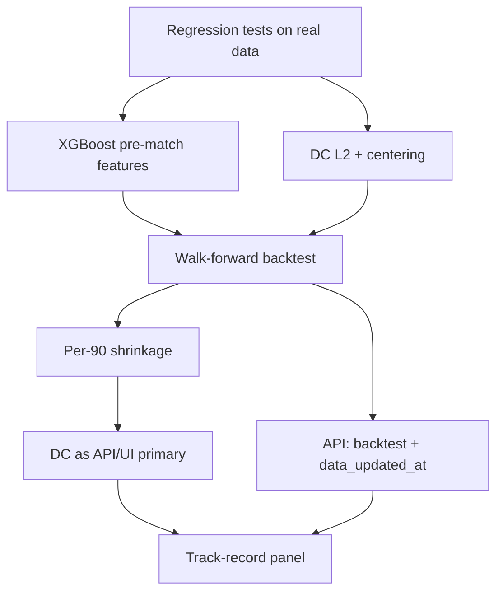

# V2 parity backport — implementation plan

Branch: `feat/v2-parity-backport`

Closes the model-quality gaps identified against the v1 parity hand-off. Each
item is a small, self-contained change — not a rewrite.

Architecture mapping: `backend/app` (v1) ↔ `packages/atwc26_core` + `services/*` (v2).

---

## Status board

| # | Item | Priority | Status | Primary files |
|---|------|----------|--------|---------------|
| 1 | Dixon-Coles L2 + identifiability | P0 | Done | `etl/train/dixon_coles.py` |
| 2 | Per-90 shrinkage in Predictor | P1 | Done | `packages/atwc26_core/.../prediction.py` |
| 3 | Out-of-sample backtest | P1 | Done | `etl/eval/backtest.py`, `data/backtest_summary.json` |
| 4 | Dixon-Coles as primary | P1 | Done | `services/predict_api/.../main.py`, frontend defaults |
| 5 | `/api/backtest` + `data_updated_at` | P1 | Done | predict + analytics health |
| 6 | XGBoost leak — pre-match features | P0 | Done | `etl/train/features.py`, `xgboost_model.py` |
| 7 | Track-record panel + DC-default UI | P2 | Done | `TrackRecordPanel`, predict page |

Test plan: [V2_PARITY_TEST_PLAN.md](V2_PARITY_TEST_PLAN.md).

---

## Suggested order (executed)



---

## 1. Dixon-Coles L2 regularization (P0)

**Problem.** Unpenalized MLE on ~148 teams / ~428 matches does not converge.
Committed `dc_params.json` had `converged: false` and nonsense extremes
(Hungary attack ≈ 1.91, El Salvador ≈ −6.1).

**Fix.**
- Add L2 penalty on attack/defence parameters (`L2_LAMBDA = 1.0`).
- After fit, center `sum(α)=0` and `sum(β)=0` for identifiability.
- Keep `converged` flag; refuse to treat unbounded params as healthy in tests.

---

## 2. Per-90 shrinkage (P1)

**Problem.** Low-minute players keep raw noisy per-90 rates in the Poisson
Predictor.

**Fix.** Empirical-Bayes shrink toward role reference:

```
w = minutes / (minutes + k)   # k = 45
rate_shrunk = w * rate + (1 - w) * role_ref
```

Applied in `_rate_team` before role-weighted aggregation.

---

## 3. Out-of-sample backtest (P1)

**Problem.** No credibility layer — no held-out metrics for Elo / DC / XGB.

**Fix.** `etl/eval/backtest.py`:
- Chronological 80/20 split on the match matrix.
- Train Elo + Dixon-Coles on the train slice; score log-loss / accuracy / Brier
  on the hold-out.
- Persist `data/backtest_summary.json` from `etl/train/run.py`.

---

## 4. Dixon-Coles as primary (P1)

**Problem.** Multi-model predict and quick-predict defaulted to Poisson.

**Fix.** Prefer `dixon_coles` when available; fall back to Poisson. Frontend
model selector and `quickPredict` follow the same default.

---

## 5. `/api/backtest` + `data_updated_at` (P1)

**Problem.** Endpoints / freshness fields missing.

**Fix.**
- `GET /api/backtest` on predict service (reads `backtest_summary.json`).
- `data_updated_at` on analytics + predict health (newest artifact
  `generated_at` / mtime among key data files).

---

## 6. XGBoost leak (P0)

**Problem.** Training used **same-match** team xG/shots; inference used
tournament per-90 XI sums — train/serve mismatch and label leakage.

**Fix.** Rolling pre-match attack stats (`add_rolling_attack_stats`, shifted
like form) for `xg_diff` / `shots_diff` / `sot_diff`. Retrain required
(`make etl-train`).

---

## 7. Track-record panel + DC-default UI (P2)

**Problem.** No UI for backtest credibility; defaults favored Poisson.

**Fix.** `TrackRecordPanel` on the predict page; default model =
`dixon_coles` when listed in `models_available`.

---

## Retrain note

After merge, operators should run:

```bash
make etl-train
```

so `dc_params.json`, `xgb_model.ubj`, and `backtest_summary.json` reflect the
new training code. Until then, engines still load existing artifacts; DC may
remain non-converged until retrain.
