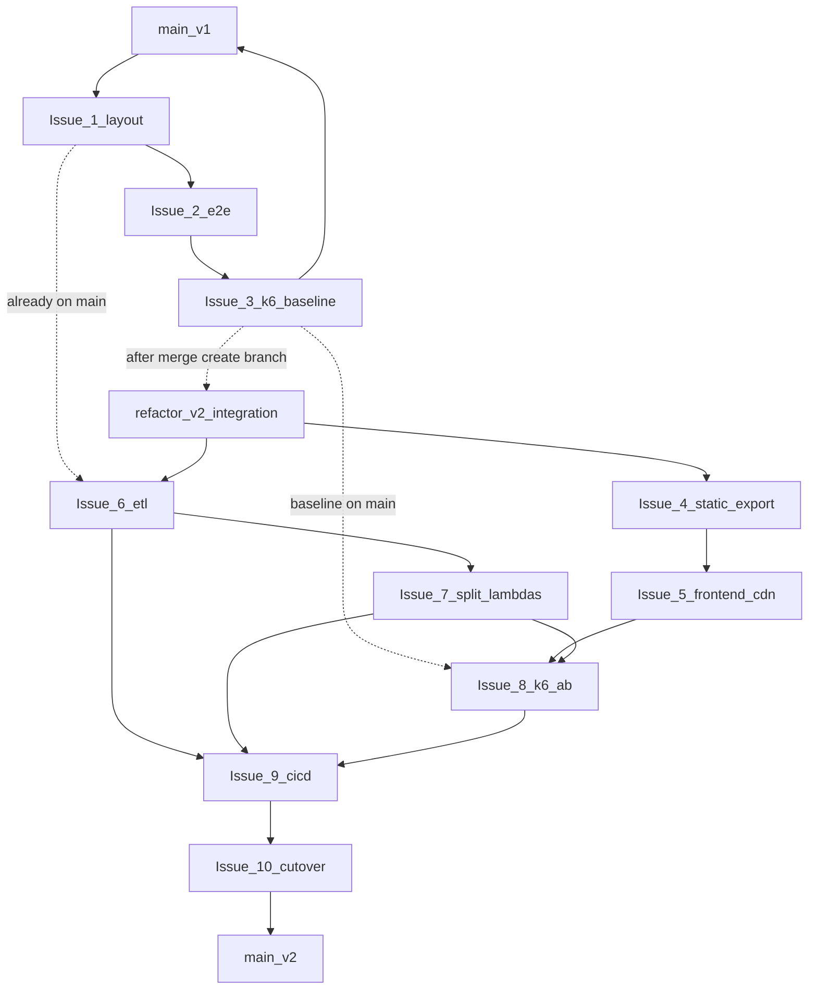

# v2 refactor — branch handoff (index)

Production ([atwc26.com](https://atwc26.com)) runs the **v1 monolith** on `main` until Issue 10 cutover.

## Current status *(updated July 2026)*

| Milestone | Status |
|-----------|--------|
| **Track A — Issues 1–3** | **Complete** on `main` |
| **ETL layout follow-up** | **Complete** — [#25](https://github.com/neunov/AnalyseThisWC26/issues/25) merged (PR #26) |
| **Docs reorganize** | **On branch** `docs/reorganize-documentation` — `docs/etl/`, `docs/ops/`, [ARCHITECTURE.md](../ARCHITECTURE.md), [V1_TO_V2.md](../V1_TO_V2.md) |
| **`refactor/v2-integration`** | **Created** from `main`; merge `main` into it after doc/plan updates |
| **Track B — Issues 4–10** | **Open** on GitHub — see mapping below |
| **`v1-baseline` tag** | Optional — not yet applied |
| **`docs/ops/CUTOVER.md`** | Created; keep updating during Issues 8–10 |

After this doc PR merges to `main`, sync the integration branch:

```bash
git checkout refactor/v2-integration && git merge main && git push
```

---

## Two tracks

| Track | Issues | Target branch | Status |
|-------|--------|---------------|--------|
| **v1 prep** | 1–3 | `main` | **Done** |
| **v2 refactor** | 4–10 | `refactor/v2-integration` | **In progress** |

```text
main ──► Issue 1 ──► Issue 2 ──► Issue 3 ──► (tag v1-baseline optional)  ✓ done
                                              │
                                              ▼
                              refactor/v2-integration  ✓ exists
                              Issue 4 → … → Issue 10 → merge to main
```

## Documents

| Doc | Purpose |
|-----|---------|
| **[V1_TO_V2.md](../V1_TO_V2.md)** | v1 → v2 rationale, comparison, retroactive decision log, ADR guidance |
| **[ARCHITECTURE.md](../ARCHITECTURE.md)** | Current v2 C4 + AWS map |
| **[REFACTOR_GITHUB_ISSUES.md](REFACTOR_GITHUB_ISSUES.md)** | Issue titles, bodies, acceptance criteria |
| **[CUTOVER.md](../ops/CUTOVER.md)** | Production cutover checklist |
| **[../TODO.md](../../TODO.md)** | File-by-file execution checklist (no WAF phase) |

### Current architecture constraints (v2 candidate)

- CloudFront is CDN + TLS only (**no WAF in this phase**).
- CloudFront routes `/api/*` to API Gateway.
- API Gateway route split: read endpoints → **analytics Lambda**; `POST /api/predict` → **predict Lambda** (default) or **ECS/ALB** when `enable_ecs_compute=true`.
- S3 remains source-of-truth ETL storage; DynamoDB holds publish manifest + precomputed API cache slices.

### Execution tracker issues (phase-by-phase)

- [#58](https://github.com/neunov/AnalyseThisWC26/issues/58) Phase A - Infra route split (CloudFront/API Gateway, no WAF)
- [#59](https://github.com/neunov/AnalyseThisWC26/issues/59) Phase B - Standings cache slice (`API#standings`)
- [#60](https://github.com/neunov/AnalyseThisWC26/issues/60) Phase C - Teams + team players cache slices
- [#61](https://github.com/neunov/AnalyseThisWC26/issues/61) Phase D - Matches + match detail + player detail cache slices
- [#62](https://github.com/neunov/AnalyseThisWC26/issues/62) Phase E - ECS refresh + data versioning finalization
- [#63](https://github.com/neunov/AnalyseThisWC26/issues/63) Phase F - CI hardening + docs/cutover rehearsal

---

## Plan # → GitHub issue mapping

Plan numbers (1–10) are the refactor sequence. GitHub issue numbers differ for v2 work:

| Plan # | GitHub | Title | Status |
|--------|--------|-------|--------|
| 1 | — | reorganize docs, notebooks, scrapers | Merged to `main` |
| 1b | [#25](https://github.com/neunov/AnalyseThisWC26/issues/25) | complete ETL file moves + Makefile | Merged to `main` |
| 2 | — | e2e tests for v1 API | Merged to `main` |
| 3 | — | k6 baseline vs production | Merged to `main` |
| 4 | [#30](https://github.com/neunov/AnalyseThisWC26/issues/30) | static export frontend for S3 | Open |
| 5 | [#27](https://github.com/neunov/AnalyseThisWC26/issues/27) | S3 + CloudFront static frontend | Open |
| 6 | [#28](https://github.com/neunov/AnalyseThisWC26/issues/28) | ETL pipeline with S3, DynamoDB, QA | Open |
| 7 | [#29](https://github.com/neunov/AnalyseThisWC26/issues/29) | split analytics + predict Lambdas | Open |
| 8 | [#31](https://github.com/neunov/AnalyseThisWC26/issues/31) | k6 A/B compare v1 and v2 | Open |
| 9 | [#32](https://github.com/neunov/AnalyseThisWC26/issues/32) | complete CI/CD pipeline | Open |
| 10 | [#33](https://github.com/neunov/AnalyseThisWC26/issues/33) | cut over to v2, remove v1 monolith | Open |

Use **plan #** in PR bodies (`Closes #30` for plan Issue 4, etc.).

---

## Branch strategy

### Track A — v1 prep (Issues 1–3) ✓

| Setting | Value |
|---------|--------|
| Base | `main` |
| Feature branches | `feat/reorganize-layout`, `feat/e2e-tests-v1`, `feat/k6-baseline` |
| Merge into | **`main`** directly |
| Label | `refactor-v1` |

**Also merged (follow-up):** `fix/etl-paths-makefile` → `main` ([#25](https://github.com/neunov/AnalyseThisWC26/issues/25)).

### Track B — v2 refactor (Issues 4–10)

| Setting | Value |
|---------|--------|
| Base | `refactor/v2-integration` (from `main` after Issue 3) |
| Feature branches | `feat/*` per issue below |
| Merge into | **`refactor/v2-integration`** |
| Final merge | Issue 10: `refactor/v2-integration` → **`main`** |
| Label | `refactor-v2` |

**PR rules:**

1. Do **not** PR v2 feature branches directly to `main` (except final cutover and doc/plan fixes).
2. One issue = one PR; `Closes #N` in body (use GitHub # from mapping table).
3. Merge order: 4 → 10 (Issues 4 and 6 can run in parallel after integration branch exists).
4. Candidate AWS: separate `name_prefix` (e.g. `atwc26-v2`).
5. Tag `main` before final merge: `v1-monolith`.
6. After merging doc or v1 fixes to `main`, merge `main` into `refactor/v2-integration`.

### Labels

- `refactor-v1` — Issues 1–3 *(complete)*
- `refactor-v2` — Issues 4–10
- `blocked` — waiting on upstream
- `ops` — Issue 10 cutover

---

## Dependency graph



---

## Issue → branch → target (summary)

| # | Track | Branch | Merges to | Commit subject |
|---|-------|--------|-----------|----------------|
| 1 | v1 | `feat/reorganize-layout` | `main` | `refactor: move docs, notebooks, and scrapers` |
| 2 | v1 | `feat/e2e-tests-v1` | `main` | `test: add end-to-end tests for v1 API` |
| 3 | v1 | `feat/k6-baseline` | `main` | `perf: k6 baseline against v1 production` |
| 4 | v2 | `feat/frontend-static-export` | `refactor/v2-integration` | `feat(v2): static export frontend for S3` |
| 5 | v2 | `feat/frontend-cdn-infra` | `refactor/v2-integration` | `infra(v2): S3 and CloudFront for static frontend` |
| 6 | v2 | `feat/etl-pipeline-aws` | `refactor/v2-integration` | `feat(v2): ETL pipeline with S3, DynamoDB, and QA` |
| 7 | v2 | `feat/split-lambda-apis` | `refactor/v2-integration` | `feat(v2): split APIs into analytics and predict Lambdas` |
| 8 | v2 | `feat/k6-ab-compare` | `refactor/v2-integration` | `perf(v2): k6 A/B compare v1 and v2` |
| 9 | v2 | `feat/full-cicd` | `refactor/v2-integration` | `ci(v2): complete CI/CD pipeline` |
| 10 | v2 | `chore/remove-v1-monolith` | `refactor/v2-integration` then `main` | `chore(v2): cut over to v2 and remove v1 monolith` |

Full issue bodies: [REFACTOR_GITHUB_ISSUES.md](REFACTOR_GITHUB_ISSUES.md)

---

## Contributor message template

```text
Refactor is split across two tracks:

v1 on main — DONE:
  #1 reorganize docs / notebooks / etl/scrape
  #25 complete ETL moves (fetch_schedule, scrape_history, build_match_events)
  #2 e2e tests (e2e/) for v1 API
  #3 k6 baseline vs atwc26.com

v2 on refactor/v2-integration (GitHub #27–#33):
  #4  GH #30 — static frontend + S3
  #5  GH #27 — S3/CloudFront (still v1 API)
  #6  GH #28 — ETL + S3 + DynamoDB + shared package
  #7  GH #29 — split Lambdas (analytics + predict)
  #8  GH #31 — k6 A/B v1 vs v2
  #9  GH #32 — full CI/CD
  #10 GH #33 — cutover → main

Docs: [planning/REFACTOR_GITHUB_ISSUES.md](REFACTOR_GITHUB_ISSUES.md)
```

---

## Next actions

1. ~~Create labels `refactor-v1` and `refactor-v2`.~~ Done
2. ~~Merge Issues 1–3 to `main`.~~ Done
3. ~~Create `refactor/v2-integration` from `main`.~~ Done
4. **Open PRs for Issues 4–9** → `refactor/v2-integration` (GitHub #30, #27, #28, #29, #31, #32).
5. Optional: tag `main` as `v1-baseline`.
6. Issue 10 (GH #33): integration → `main` after k6 A/B and [ops/CUTOVER.md](../ops/CUTOVER.md) checklist.
